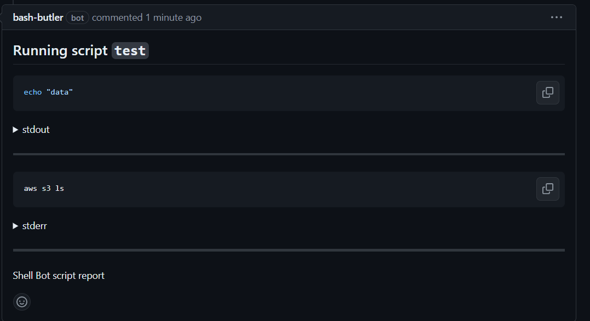

# Github Shell Bot - GitHub App

A GitHub bot that runs shell scripts from PR comments.

## Motivation

This GitHub App was created to facilitate and improve the experience of running repetive tasks in shell scripts usign GitHub comment functionality as a platform for ChatOps. Previous to this repository, I implemented something similar using GitHub Actions, however there were some negative side effects with Actions:

- Flooding the Actions workflow history with comments
- Actions start time is a disadvantage for tasks that need to be executed ASAP
- When there is need to wait for something (like waiting for a RDS DB to become available, wich takes ~10 minutes), the Actions spending will go up considerably
- Poor feedback/reporting from actions without creating a monstruous workflow

## How to run

1. Configure a GitHub App and deploy the server
2. Configure your server with the required environment variables
3. Configure your GitHub App to send webhooks to your server URL
4. Add a `command.yaml` with the scripts you want to run in the repository you will run commands
5. Comment on a PR



## Configuring the server

The server needs to be configured via rnvironment variables. Check `.env.sample` for a reference on required and optional configuration.

## Declaring commands

Here is an example of the `command.yaml` file:

```yaml
script:
  - echo "do something"
  - aws s3 ls
```

## Deploying

Running the command bellow will start a server in http://localhost:3000

```bash
npm i && npm run server
```

Or using docker

```bash
docker run -p 3000:3000 ghcr.io/joao-zanutto/github-shell-bot
```

## Execution

Currently the only suported executor is `local`, meaning that the commands will be executed in the server/container the app is executed on.
